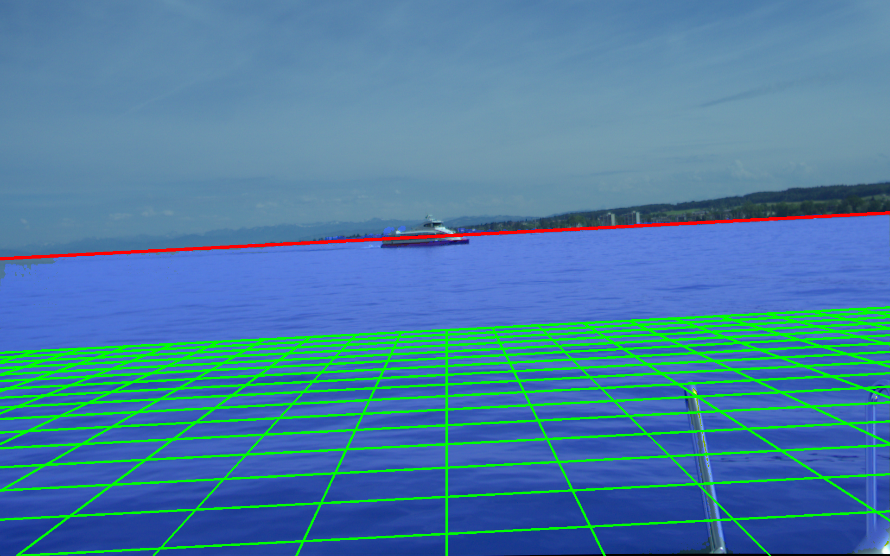
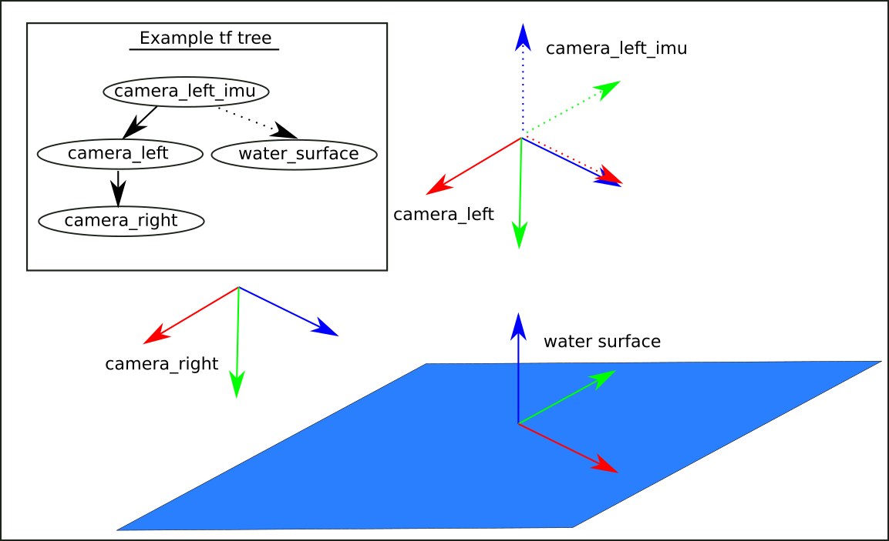

# water_surface_detector

This package is a ROS node to estimate pitch, roll and sensor height for maritime applications with a stereo camera system. It estimates also the ground plane (water surface) and in combination with a calibrated lidar it can be used to generate an occupancy grid for object detection and collision avoidance.



## Nodes

### estimator_stereo

The node estimates camera roll, pitch and height in relation to the water surface (visual inertial measurement unit).

#### Parameters
Can be set in config/params.yaml

- **`stereo/masking/dataset_mean`** (array) Mean to standardize image for cnn
- **`stereo/masking/dataset_mean`** (array) Std to standardize image for cnn
- **`stereo/masking/scale`** (float) Scale of image resizing for masking. Allowed are: 1,1.5,2,3,4,6. Higher value means faster but worse masking.
- **`stereo/masking/threshold`** (float) Masking Threshold, high value results in less false positives but also less true positives.
- **`stereo/estimation/scale`** (int) Scale of image resizing for point cloud generation. Allowed are: 1,1.5,2,2.4,3,4,6. Should be <= masking scale.
- **`stereo/estimation/surface_max_z`** (int) Maximum z coordinate (matches roughly distance to camera) of water points to be considered in regression of water surface.
- **`stereo/estimation/ransac_max_trials`** (int) Maximum RANSAC runs.
- **`stereo/estimation/ransac_res_threshold`** (int) Threshold to classify inliers.
- **`stereo/estimation/ransac_stop_prob`** (float) Inlier probability.
- **`stereo/masking/model_path`** (string) Relative path from package to segmentation model.
- **`stereo/sgbm/block_size`** (int) Kernel size for block matching.


#### Subscribed topics
- **`/stereo/left/image_raw`** : (sensor_msgs/Image.msg) image of the left camera.
- **`/stereo/left/camera_info`** : (sensor_msgs/CameraInfo.msg) calibration parameters for the left camera.
- **`/stereo/right/image_raw`** : (sensor_msgs/Image.msg) image of the right camera.
- **`/stereo/right/camera_info`** : (sensor_msgs/CameraInfo.msg) calibration parameters for the right camera.

#### Published topics
- **`/stereo_imu/horizon`** : (sensor_msgs/Image.msg) Plot virtual horizon (red), segmentation result (blue overlay) and ground plane (green grid) to the image (see figure above).
- **`/stereo_imu/surface`** : (visualization_msgs/Marker.msg) Marker to visualize the ground plane.
- **`/stereo_imu/surface_points`** : (sensor_msgs/PointCloud2.msg) Reconstructed point cloud of the water surface.
- **`/stereo_imu/pose`** : (geometry_msgs/PoseStamped.msg) Pose of the left camera in relation to the ground plane.


### obstacle detector

The node uses the detected water plane from estimator_stereo and combines it with lidar measurements to create an occupancy grid.

#### Parameters
Can be set in config/params.yaml

- **`grid/width`** (int) Occupancy grid width in pixels.
- **`grid/height`** (int) Occupancy grid height in pixels.
- **`grid/resolution`** (int) Resolution in Pixel/Meter.
- **`grid/max_height`** (float) Maximal height of objects above surface level in meters to be recognised as obstacle.
- **`grid/min_height`** (float) Minimum height of objects above surface level in meters to be recognised as obstacle.
- **`grid/dist_front`** (int) The distance defines a zone around the coordinate origin (of the lidar) where objects are not recognised as obstacles (e.g. parts of the boat)
- **`grid/dist_back`** (int) Same as grid/dist_front.
- **`grid/dist_right`** (int) grid/dist_front.
- **`grid/dist_left`** (int) grid/dist_front.
- **`lidar/topic`** (str) Topic name on which lidar points are published.


#### Subscribed topics
- **`/tf`** : (tf/tfMessage.msg) Get transformation between camera and water plane.
- **`/lidar_points`** : (sensor_msgs/PointCloud2.msg) Point cloud from lidar. (topic name can be set in params.config)

#### Published topics
- **`/obstacle/grid`** : (nav_msgs/OccupancyGrid.msg) Occupancy grid.


## Run an example
We provide an example bag file in this repository to test the nodes. It contains a 5 second sequence with a sailboat.

#### Test the visual imu
```sh

cd catkin_ws
rosparam set use_sim_time true
roslaunch surface_detector stereo.launch
rosbag play --clock example.bag -r 0.5

```

#### Test obstacle detector
```sh

cd catkin_ws
rosparam set use_sim_time true
roslaunch surface_detector stereo_obstacle.launch
rosbag play --clock example.bag -r 0.1

```

## Notes
So that the nodes work well, we assume that a tf tree similar to that in the image below is available. camera_left and camera_right are the rectified cameras. camera_left_imu is a coordinate system that is at the same position as the left_camera but oriented as a classical imu coordinate system. The transform to water surface is estimated by the estimator_stereo node.

